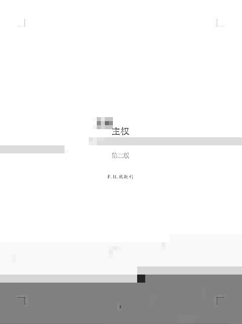
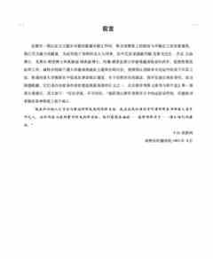

# Scholar PDF Translator v2.6

Scholar PDF Translator 是一个面向学术研究、专业阅读和长篇文献处理的本地 PDF 翻译与中文书稿重建工具。它试图解决一个在现有 AI 翻译工作流中经常被忽视的问题：**真正影响学术阅读效率的，不只是“能不能把句子翻译出来”，还包括能不能正确理解一本书或一篇论文的结构，并把翻译结果重新组织成一份可持续阅读、引用、校对和编辑的正式文稿。**

目前许多常见的 AI 翻译工具更擅长完成“文本层面的翻译”，但在处理复杂 PDF 时往往会遇到一系列结构性问题，例如：

- 双栏论文的阅读顺序被打乱；
- 页眉、页脚、页码、馆藏章、扫描标记被误当成正文；
- 章节标题、小节标题、正文和长引文无法可靠区分；
- OCR 后的脚注编号和注释正文混入正文；
- 原书采用章末注或书末注时，翻译后难以恢复为真正的页下注；
- 目录层级被破坏，无法按原书结构重新生成；
- 扫描版图书中的断行、跨页段落和乱码污染最终译稿；
- 翻译完成后只能得到按页机械拼接的文本，难以直接作为中文书稿阅读；
- 用户已经有一份译文时，仍然需要重复 OCR 或重复翻译，浪费 API 成本和时间。

这些问题对于普通短文本影响有限，但对于学术专著、论文集、历史文献、政策报告和数百页扫描书籍会迅速累积。最终得到的译文虽然“句子已经翻译”，却仍然很难真正使用。

Scholar PDF Translator 因此把 PDF 翻译理解为一条完整的文献处理链，而不只是一次模型调用：

**PDF → 文本层检测 / OCR → 版面与单双栏识别 → 文本清洗 → AI 翻译 → 原文对照校对 → 书稿结构识别 → 目录重建 → 页眉页脚与扫描噪声清理 → 章末注 / 书末注配对 → Word 原生页下注 → 中文书稿 / 双语对照稿导出**

项目的目标，是让研究者最终得到的不是一堆“已经翻译过的页面”，而是一份可以直接阅读、检索、批注、引用和继续编辑的中文学术文稿。


## Before / After：为什么需要“书稿重建”

下面两张是实际 PDF 翻译工作流中出现过的原始 AI 翻译结果。可以看到，问题往往已经不再是某一句“有没有翻译成中文”，而是**文档结构本身已经损坏**：下载源和馆藏元数据混入正文、版权信息与目录串在一起，中英文残留交错，章节层级不统一，原本可读的目录失去结构。

### 常见的原始 AI / PDF 翻译结果

**示例 1：元数据、版权页、目录与正文混杂**

<p align="center">
  
</p>

**示例 2：目录只完成局部翻译，章节层级和语言混排**

<p align="center">
  
</p>

Scholar PDF Translator 增加的核心步骤，是在翻译之后继续进行**结构识别、内容清洗、目录重建、章节层级恢复、引文处理和正式书稿排版**。同一类长篇学术文献可以被重新组织成更接近中文图书的连续稿件。

### 经过书稿重建后的输出

**书名页**

<p align="center">
  
</p>

**自动重建的中文目录**

<p align="center">
  
</p>

**重新排版的正文 / 前言**

<p align="center">
  
</p>

> 这些截图用于展示“原始机器翻译输出”与“结构化中文书稿重建”之间的差异。不同 PDF 的 OCR 质量、原始版式和模型表现会有所不同，因此这里展示的是实际工作流示例，而不是对所有 AI 翻译产品效果的统一判断。


## 为什么做这个项目

对于需要长期阅读外文学术文献的人来说，PDF 翻译通常不是一个简单的语言问题，而是一个“文档理解 + 翻译 + 编辑 + 排版”的复合任务。

一本 200–500 页的英文专著中，可能同时包含：

- 书名页和版权页；
- 前言、导论、部分、章、节、小节；
- 正文；
- 独立长引文；
- 图表和图题；
- 页下注、章末注、书末注；
- 参考文献；
- 索引；
- 每页重复出现的 running header；
- 扫描平台留下的水印、馆藏章、条码和页码。

如果只把 PDF 每一页提取成字符串再送给大模型，最终很容易把这些完全不同的元素混为一谈。Scholar PDF Translator 的设计重点因此放在“恢复文档结构”上。

它希望尽可能完成下面几件事：

1. **让 AI 先理解文档，再翻译文档。**  
   对电子 PDF 优先读取原始文本层，对扫描页才调用 OCR，并利用页面坐标恢复单双栏阅读顺序。

2. **把翻译和校对拆开。**  
   第一轮负责翻译，第二轮重新同时读取原文和译文，检查漏译、误译、数字、年份、专有名词、OCR 错误和术语一致性。

3. **把排版变成“书稿重建”，而不是简单格式转换。**  
   系统重新识别书名、作者、部分、章、节、正文、引文、脚注、参考文献等角色，再生成新的中文文稿结构。

4. **尽量恢复真正的学术注释系统。**  
   对原书的章末注或书末注，尝试识别正文中的注号和注释条目，并在 Word 导出时转换为原生页下注，而不是继续把注释堆在正文中。

5. **允许已有译文直接进入编辑阶段。**  
   如果已经拥有双语 HTML、译文 HTML、Word 或项目 JSON，可以跳过 OCR 和翻译，直接进行书稿清洗、结构恢复和正式排版。

## 面向谁

这个项目尤其适合：

- 需要阅读大量英文专著和论文的硕士生、博士生和研究人员；
- 需要处理政治学、社会学、历史学、法学、哲学、经济学等长篇学术文本的用户；
- 需要把扫描版旧书、报告或档案整理成可读中文稿的人；
- 希望自己控制模型、API、术语表和翻译提示词，而不是完全依赖封闭式在线翻译服务的人；
- 已经有机器译稿，希望进一步做目录、脚注、章节和书稿清洗的人。

它并不试图替代专业译者或学术编辑。更准确地说，它希望自动完成那些最耗时间、最机械、最容易因长文档而出错的步骤，让研究者把精力集中在概念判断、术语选择、史实核对和真正需要人工决定的地方。

## 主要功能

### 1. PDF 文本层与 OCR

电子 PDF 优先使用原始文本层。扫描页或文本层质量不足的页面再进入 OCR，避免对所有页面重复识别造成额外错误。

### 2. 版面与双栏识别

利用 PDF 文本块的坐标信息判断页面布局，并恢复双栏论文常见的“左栏 → 右栏”阅读顺序。

### 3. 页眉页脚与扫描噪声清理

识别跨页重复的页眉、页脚、页码，以及常见的馆藏标记、扫描平台文字、条码和 OCR 孤立乱码。

### 4. 多阶段 AI 翻译

翻译阶段支持携带前文上下文，以减少跨页术语漂移。校对阶段重新输入原文和译文，重点检查：

- 漏译；
- 误译；
- OCR 错误；
- 人名、机构名和专有名词；
- 数字、年份和比例；
- 段落遗漏；
- 术语前后不一致。

### 5. AI 书稿重建

翻译完成后，系统可以再次对连续文本进行结构分析，将内容区分为：

- 书名；
- 作者；
- 版权信息；
- 前言；
- 部分；
- 章标题；
- 节标题；
- 小节标题；
- 正文；
- 独立长引文；
- 题词；
- 图题和表题；
- 注释；
- 参考文献；
- 附录；
- 索引；
- 应删除的噪声。

### 6. 目录重建

不机械复制 OCR 后的旧目录，而是根据最终识别出的章节结构重新生成 Word 标题层级和目录。

### 7. 原生 Word 脚注

对于章末注和书末注，系统尝试建立：

**正文注号 → 所属章节 → 对应注释条目**

导出 Word 时转为 Word 原生脚注，使注释真正出现在对应页面底部。

### 8. 中文书稿 Word 与双语 Word

可导出：

- 中文连续书稿 Word；
- 原文 / 译文双语对照 Word；
- 译文 HTML；
- 双语 HTML；
- 项目 JSON。

中文书稿会重新分页，而不是机械继承原 PDF 的页界。

## 支持的 AI 平台

- DeepSeek
- OpenAI
- Anthropic Claude
- Google Gemini
- Alibaba Qwen（DashScope OpenAI-compatible）
- Moonshot Kimi（OpenAI-compatible）
- OpenRouter
- 任意 OpenAI-compatible 自定义接口

模型 ID 均可手动修改，因此也可以使用各平台后续推出的新模型。

API Key 按平台分别保存在系统安全凭据存储中：

- macOS：Keychain
- Windows：DPAPI

不同平台的 Key 相互独立，切换模型不会覆盖其他平台的凭据。API Key 不写入 HTML、项目 JSON 或 GitHub 仓库。

## 核心流程

```text
PDF
 ↓
文本层检测 / OCR
 ↓
版面与单双栏识别
 ↓
页眉页脚与扫描噪声清理
 ↓
文本分段
 ↓
AI 初译
 ↓
原文对照校对
 ↓
全文术语一致性检查
 ↓
AI 书稿重建
 ↓
目录与标题层级恢复
 ↓
脚注 / 章末注 / 书末注配对
 ↓
中文书稿 Word / 双语 Word
```

## macOS

双击：

`启动翻译工具.command`

程序会启动本地服务器并自动打开浏览器。

停止时双击：

`停止翻译工具.command`

## Windows

双击：

`启动翻译工具.bat`

需要 Python 3。首次运行时会自动安装 Word 导出所需的 Python 组件。

停止时双击：

`停止翻译工具.bat`

## 已有译文直接重建

如果已经完成翻译，不需要重新调用模型翻译整本书。

目前支持导入：

- 双语 HTML；
- 纯中文译文 HTML；
- Word `.docx`；
- 项目 JSON。

导入后可以直接进入：

**AI 书稿重建 → 目录恢复 → 噪声清洗 → 脚注配对 → 中文 Word 导出**

这对于已经翻译完成的大型专著尤其有用，可以显著减少重复 API 调用。

## 隐私与数据

PDF 解析和 OCR 尽可能在浏览器本地完成。

只有需要 AI 处理的文本内容，例如翻译、校对和书稿结构重建，会发送到用户自己选择并配置的模型 API。项目本身不内置公共 API Key，也不会把用户的 Key 提交到仓库。

## 项目定位

Scholar PDF Translator 目前仍然是一个持续迭代中的研究型工具。复杂扫描件、数学公式、极端版式、图文混排和严重 OCR 污染仍可能需要人工检查。

它的目标不是实现“一键得到完美译著”，而是把长篇学术文献从原始 PDF 到可读中文书稿之间的大量机械工作自动化，并把每一步尽可能做成可检查、可修改、可替换模型的开放工作流。

如果这个工具能够让研究者少花几个小时整理页眉页脚、修复段落、寻找注释、重做目录，而把更多时间用在真正的阅读、理解和研究上，那么这个项目就已经达到了它最重要的目的。
